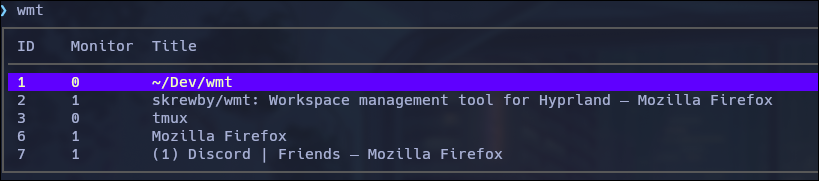

# WMT

A very simple workspace viewer tool for hyprland. I normally launch it from a keybind which allows me to quickly view my workspaces and jump to them.

## Usage
- Clone the repository
- Run `go build`
- Move the `wmt` binary to a directory that is on your `$PATH`
- Optional: add a keybind on hyprland.conf that launches the program
